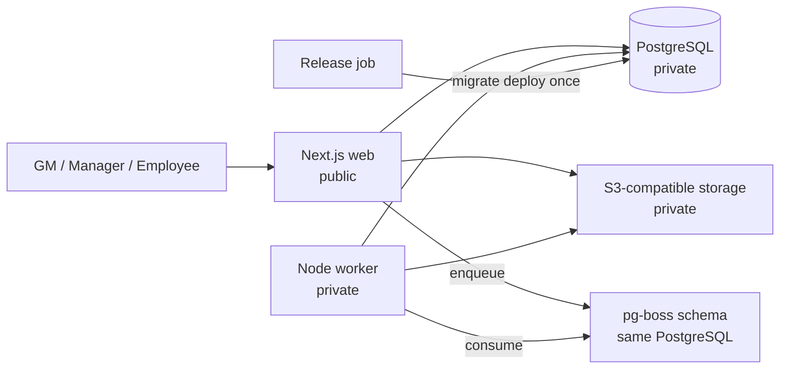

# Kiến trúc hệ thống

## 1. Bối cảnh

Hệ thống là modular monolith trong monorepo, dùng một PostgreSQL làm source of truth. Web xử lý UI/API ngắn; worker xử lý export, import commit và calculation dài. Không tách microservice theo module ở v1.



## 2. Monorepo

```text
apps/
  web/       Next.js App Router, route handlers, UI
  worker/    pg-boss consumers and long-running jobs
packages/
  contracts/ Zod DTOs shared across boundaries
  db/        Prisma schema/client/repositories
  domain/    pure authorization/business policies
  ui/        reusable presentational components
```

Dependency direction:

```text
apps/web ─┬─> contracts ─> domain
          ├─> db
          └─> ui
apps/worker ─> contracts/domain/db
db ─> domain types only when unavoidable
ui ─> no db/domain infrastructure
```

Route handlers chỉ parse input, lấy session, gọi application service và map error/DTO. React component không gọi Prisma.

## 3. Auth và authorization

- Better Auth, Prisma adapter, database sessions.
- Email/password bật; username plugin phục vụ email hoặc username.
- Không expose sign-up UI/API cho người dùng. Chỉ GM service tạo account qua server-side admin flow.
- User có `companyId`, `role`, optional `staffId`, `active`.
- Session được đọc tại server. Mỗi application service dựng `ActorContext`.
- Authorization policy thuần quyết định role capability; repository luôn nhận explicit company/scope.
- TM branch scope được query từ active assignment theo server time; request không thể mở rộng scope.
- Route/proxy redirect chỉ là UX, không thay thế service authorization.

## 4. Tenant và chống IDOR

Mọi repository method bắt buộc nhận `companyId`. Method scoped nhận thêm `allowedBranchIds` lấy từ session. Fetch-by-ID dùng compound filter:

```ts
where: {
  id,
  companyId: actor.companyId,
  ...(actor.role === "TRAINING_MANAGER"
    ? { branchId: { in: actor.activeBranchIds } }
    : {}),
}
```

Nếu không tìm thấy trong scope, API trả lỗi không tiết lộ object có tồn tại ngoài scope. DTO dùng allow-list và bigint serializer.

## 5. Transaction và audit

Application service mutation:

1. validate request bằng Zod;
2. authorize actor;
3. mở transaction;
4. đọc current record trong tenant scope;
5. kiểm tra version/invariant;
6. mutate;
7. append audit before/after với reason/request metadata;
8. commit;
9. trả DTO đã redaction.

Audit append-only. Dữ liệu nhạy cảm như password hash, secret, session token không bao giờ nằm trong before/after.

## 6. Caching và rendering

- Dữ liệu authenticated mặc định `Cache-Control: private, no-store`.
- Không dùng shared fetch cache cho query có session.
- Nếu thêm cache sau này, key phải chứa company/branch/user và version quyền.
- Dashboard Phase 1 dùng Server Components động; mutation qua route handlers.

Branch monthly overview là read projection, không phải aggregate table:

- query staff/assignment + level history và attendance/live/violation theo tập staff, không query từng row;
- client chỉ giữ edit state; mutation ghi ngược attendance/live source qua application service hiện có;
- tổng dùng BIGINT/Decimal-safe domain function; API vẫn serialize tiền thành string;
- grid ảo hóa cột ngày, trong khi mobile dùng projection read-only rút gọn.

## 7. Jobs và storage

- pg-boss dùng cùng PostgreSQL, schema riêng; v1 không có Redis.
- Job payload chỉ chứa tenant/resource IDs và snapshot filter tối thiểu; worker authorize lại theo recorded actor/service policy khi phù hợp.
- Idempotency key bắt buộc cho import/export/calculation.
- S3/MinIO bucket private. Database lưu object key; signed URL chỉ phát hành sau authorize, TTL ngắn.
- Worker tạo ExcelJS/PDF server-side, không dựa vào browser.

## 8. Health và observability

- `/api/health/live`: process event loop còn phục vụ; không gọi dependency.
- `/api/health/ready`: `SELECT 1` PostgreSQL và các dependency bắt buộc của web.
- Structured logs có request ID, actor ID (không PII), company ID, event và latency.
- Không log cookie, token, password, signed URL hoặc payroll snapshot đầy đủ.
- Audit là business ledger, không thay thế operational logs/metrics.

## 9. Local và Railway

Local Docker Compose cung cấp PostgreSQL và MinIO; web/worker có thể chạy bằng pnpm hoặc container. Railway có web public, worker private, PostgreSQL private và private bucket. Release command chạy migration đúng một lần trước deploy.

Web bind `0.0.0.0:$PORT`. Docker image build từ lockfile với Corepack/pnpm frozen lockfile và non-root runtime user.

## 10. Security baseline

- Secret từ environment; fail fast nếu production thiếu secret.
- Password policy/rate limit ở Better Auth; cookie secure trong production.
- CORS/trusted origins allow-list.
- Zod giới hạn độ dài và normalize input.
- Generic auth error; không enumerate email/username.
- Optimistic concurrency cho record mutable.
- Private objects, allow-list MIME/size, scan workflow ở phase import/evidence.
- Dependency audit và secret scan trong CI ở phase hardening.

## 11. Các quyết định hoãn có chủ đích

- Không cài Redis, event bus hoặc microservice ở v1.
- Không triển khai rule expression runtime bằng JavaScript.
- Không tạo bảng aggregate tháng làm source of truth; dùng query/materialized view có refresh strategy khi cần.
- PDF engine chưa chốt; chart/virtualized grid/XLSX đã chốt tại ADR-012.
