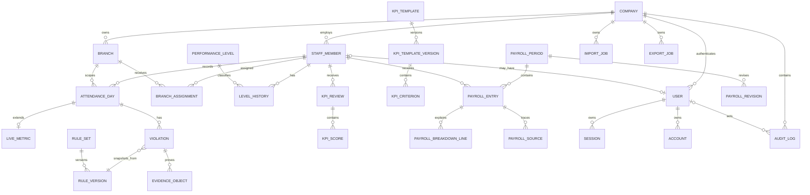

# Mô hình dữ liệu và kế hoạch migration

## 1. Quy ước

- Primary key: UUID/CUID dạng text nhất quán trong toàn hệ thống.
- Bảng nghiệp vụ luôn có `companyId`; bảng theo cơ sở có `branchId`.
- Timestamp lưu UTC (`timestamptz`); ngày nghiệp vụ là `date`.
- Khoảng hiệu lực dùng `[effectiveFrom, effectiveTo)`; `effectiveTo = null` nghĩa là chưa có điểm kết thúc.
- Tiền/doanh số: `BIGINT`; phút: `INTEGER`; số công/trọng số: `DECIMAL`.
- Bản ghi mutable có `version` cho optimistic concurrency và `updatedAt`.
- Dữ liệu lịch sử/tài chính dùng status/archive/revision, không hard-delete.

## 2. ERD logic đích



## 3. Các aggregate chính

### Identity và tổ chức

- `companies`: tenant biên bảo mật cao nhất và settings self-service.
- `branches`: cơ sở; archive bằng `isActive`.
- `staff_members`: mọi người, không phụ thuộc có tài khoản hay không; chứa job position và employment category, không chứa auth role.
- `users`, `sessions`, `accounts`, `verifications`: bảng Better Auth; user nối tùy chọn một `staff_member`, có role và `companyId`.
- `branch_assignments`: lịch sử phân công staff vào branch cùng loại assignment; Phase 1 dùng `PRIMARY`/`SECONDARY`.
- `level_history`: lịch sử performance level.

Ràng buộc PostgreSQL cần custom SQL:

```sql
EXCLUDE USING gist (
  "companyId" WITH =,
  "staffId" WITH =,
  "assignmentType" WITH =,
  daterange("effectiveFrom", "effectiveTo", '[)') WITH &&
)
WHERE ("archivedAt" IS NULL);
```

Migration bật extension `btree_gist` trước khi tạo exclusion constraint.

### Attendance và Live

- `attendance_days`: common check-in/out, work units, overtime, publish state; unique `(companyId, staffId, workDate)`.
- `live_metrics`: 1-1 với attendance; actual live minutes, revenue và dữ liệu riêng cho nhân viên Live.
- `violations`: nhiều record/ngày; snapshot mã, mô tả và `amount`; trỏ rule version để trace.
- `evidence_objects`: chỉ lưu object key private, content metadata và owner; không lưu public URL.

### Rules

- `rule_sets`: danh tính logical của loại rule và scope.
- `rule_versions`: payload JSON có schema version, trạng thái, effective interval, checksum và actor.
- Published/scheduled version bất biến. Một transaction publish phải lock rule set, kiểm tra overlap rồi chốt version.
- Database exclusion constraint bảo vệ overlap published ở lớp cuối.

### KPI và payroll

- KPI template/version/criterion tách khỏi review/score.
- Payroll period theo company + tháng, entry theo staff.
- Money fields là `BIGINT`; API serialize chuỗi.
- `calculationSnapshot` chứa input/output canonical, version schema và checksum.
- Breakdown/source là bảng riêng để query, reconcile và audit.

### Audit và jobs

- `audit_logs`: append-only, actor, action, entity, before/after JSON, reason, request ID, IP/user-agent.
- `import_jobs` có idempotency key unique theo company/type; row results lưu validation status.
- `export_jobs` lưu loại export, filter snapshot, storage object key và expiry.

## 4. Prisma schema Phase 1

Phase 1 chỉ materialize:

- Company, Branch, StaffMember, User;
- Better Auth Session, Account, Verification;
- BranchAssignment;
- AuditLog.

Attendance, rules, KPI và payroll chỉ có trong mô hình logic/tài liệu ở Prompt 0 và sẽ được thêm bằng migration riêng theo phase.

## 5. Migration plan

1. `0001_foundation`
   - extension `btree_gist`;
   - enum role, employment status/category, assignment type;
   - Better Auth tables;
   - company, branch, staff, assignment, audit;
   - unique keys, FK, indexes và assignment exclusion constraint.
2. `0002_attendance_live`
   - attendance day, live metric, violation/evidence;
   - unique attendance day và publish state.
3. `0003_versioned_rules`
   - rule set/version;
   - immutable trigger/policy và exclusion interval.
4. `0004_manager_kpi`
   - manager attendance, KPI template/version/review.
5. `0005_payroll`
   - payroll period/entry/breakdown/source/revision;
   - immutable guard khi locked/published.
6. `0006_import_export_jobs`
   - import/export job, row validation và storage metadata.

Mỗi migration production dùng `prisma migrate deploy` từ release job duy nhất. Web và worker không tự migrate khi khởi động.

## 6. Index và query plan ban đầu

- `users(companyId, role, active)`.
- `branches(companyId, active)`.
- `staff_members(companyId, employmentStatus)`.
- `branch_assignments(companyId, branchId, effectiveFrom, effectiveTo)`.
- `branch_assignments(companyId, staffId, effectiveFrom, effectiveTo)`.
- `audit_logs(companyId, occurredAt desc)` và `(companyId, entityType, entityId)`.
- Tương lai: attendance `(companyId, branchId, workDate)`; payroll `(companyId, year, month, status)`.

## 7. Xóa và retention

- Branch/staff/user: deactivate/archive, không xóa khi đã được tham chiếu.
- Assignment/level: đóng khoảng hoặc archive với audit.
- Attendance, violation, rule published, payroll, audit: không hard-delete.
- Session/verification hết hạn được purge theo retention job.
- Object storage dùng lifecycle rule; metadata lịch sử giữ theo policy pháp lý được xác nhận.
