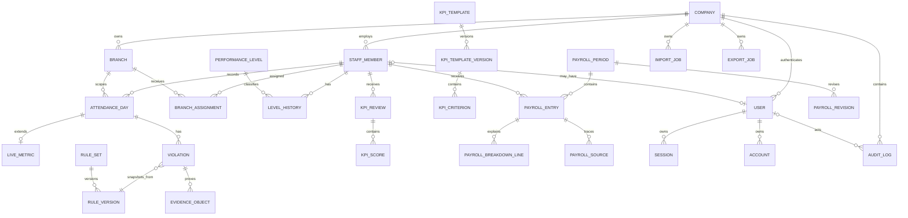

# Mô hình dữ liệu và kế hoạch migration

## 1. Quy ước

- Primary key: UUID/CUID dạng text nhất quán trong toàn hệ thống.
- Bảng nghiệp vụ luôn có `companyId`; bảng theo cơ sở có `branchId`.
- Timestamp lưu UTC (`timestamptz`); ngày nghiệp vụ là `date`.
- Khoảng hiệu lực dùng `[effectiveFrom, effectiveTo)`; `effectiveTo = null` nghĩa là chưa có điểm kết thúc.
- Tiền/doanh số: `BIGINT`; phút: `INTEGER`; số công/trọng số: `DECIMAL`.
- Bản ghi mutable có `version` cho optimistic concurrency và `updatedAt`.
- Dữ liệu lịch sử/tài chính dùng status/archive/revision, không hard-delete.

## 2. ERD logic đích



## 3. Các aggregate chính

### Identity và tổ chức

- `companies`: tenant biên bảo mật cao nhất và settings self-service.
- `branches`: cơ sở; archive bằng `isActive`.
- `staff_members`: mọi người, không phụ thuộc có tài khoản hay không; chứa job position và employment category, không chứa auth role.
- `users`, `sessions`, `accounts`, `verifications`: bảng Better Auth; user nối tùy chọn một `staff_member`, có role và `companyId`.
- `branch_assignments`: lịch sử phân công staff vào branch cùng loại assignment; Phase 1 dùng `PRIMARY`/`SECONDARY`.
- `level_history`: lịch sử performance level.

Ràng buộc PostgreSQL cần custom SQL:

```sql
EXCLUDE USING gist (
  "companyId" WITH =,
  "staffId" WITH =,
  "assignmentType" WITH =,
  daterange("effectiveFrom", "effectiveTo", '[)') WITH &&
)
WHERE ("archivedAt" IS NULL);
```

Migration bật extension `btree_gist` trước khi tạo exclusion constraint.

### Attendance và Live

- `attendance_days`: common check-in/out, work units, overtime, publish state; unique `(companyId, staffId, workDate)`.
- `live_metrics`: 1-1 với attendance; actual live minutes, revenue và dữ liệu riêng cho nhân viên Live.
- `violations`: nhiều record/ngày; snapshot mã, mô tả và `amount`; trỏ rule version để trace.
- `evidence_objects`: chỉ lưu object key private, content metadata và owner; không lưu public URL.

### Rules

- `rule_sets`: danh tính logical của loại rule và scope.
- `rule_versions`: version number, trạng thái, effective interval, notes, actor tạo/publish và optimistic row version.
- `penalty_items`: danh mục typed theo version, gồm code/name/description, BIGINT default amount, reminder/metadata, màu và thứ tự.
- Published/scheduled version bất biến. Một transaction publish phải lock rule set, kiểm tra overlap rồi chốt version.
- Database exclusion constraint bảo vệ overlap published ở lớp cuối.

### KPI và payroll

- KPI template/version/criterion tách khỏi review/score.
- Payroll period theo company + tháng, entry theo staff.
- Money fields là `BIGINT`; API serialize chuỗi.
- `calculationSnapshot` chứa input/output canonical, version schema và checksum.
- Breakdown/source là bảng riêng để query, reconcile và audit.

### Audit và jobs

- `audit_logs`: append-only, actor, action, entity, before/after JSON, reason, request ID, IP/user-agent.
- `import_jobs` có idempotency key unique theo company/type; row results lưu validation status.
- `export_jobs` lưu loại export, filter snapshot, storage object key và expiry.

## 4. Prisma schema đã materialize

Foundation materialize:

- Company, Branch, StaffMember, User;
- Better Auth Session, Account, Verification;
- BranchAssignment;
- AuditLog.

Prompt 1 materialize:

- `AttendanceDay`: unique company/staff/business date, timestamp UTC, Decimal work units, phút nguyên, version và archive;
- `LiveDailyMetric`: extension 1–1, phút Live, revenue BIGINT và snapshot cấu hình đơn vị;
- company revenue unit/scale.

Prompt 2 materialize:

- `RuleSet`, `RuleVersion`, `PenaltyItem` với no-overlap `[from,to)`, immutable trigger cho published version và item;
- `Violation` snapshot rule version, item, amount/detail theo ngày nghiệp vụ; cancel bằng status, DB chặn hard-delete;
- `EvidenceObject` lưu object key private, MIME, size, checksum và trạng thái verify;
- index theo company/branch/staff/date và audit cho toàn bộ mutation.

Prompt 3 materialize:

- `StaffMember.streamingAlias` cho ACC/alias hiển thị và tìm kiếm;
- `PerformanceLevel` và `LevelHistory` với effective interval `[from,to)`, exclusion constraint chống overlap và trigger chặn hard-delete;
- composite index attendance `(companyId, branchId, businessDate, staffId)` và index filter staff/category/status;
- overview tháng là query projection, không có bảng aggregate hoặc cột tổng nhập tay.

Prompt 4 materialize:

- rule cấu hình typed tiếp tục dùng `RuleSet`/`RuleVersion.configuration`;
- `LevelProposal` lưu đề xuất tháng, trạng thái confirm/override, lý do và effective date.

Prompt 5 materialize:

- `PayrollPeriod` versioned theo company/branch/month/revision và state machine;
- `PayrollEntry`, `CalculationSnapshot`, `PayrollLine`, `PayrollAdjustment` tạo financial ledger với BIGINT, source/rule version và canonical hash;
- `PayrollExportJob`, `PayrollDownloadLog` cho export worker, private object storage và audit tải file;
- trigger database chặn hard-delete, giữ snapshot/line append-only và khóa mutation sau `LOCKED`/`PUBLISHED`.

Prompt 6 materialize:

- `StaffEmploymentHistory` lưu employment status/category có effective interval để tái dựng nhân sự lịch sử;
- `ManagerKpiEvaluation` unique theo company/manager/tháng, snapshot template version, trạng thái DRAFT/PUBLISHED và optimistic version;
- `ManagerKpiCriterionLine` snapshot code/tên/trọng số/max score/yêu cầu note-evidence cùng điểm weighted;
- company report/dashboard là read projection, không có bảng aggregate nhập trùng;
- trigger chặn sửa/xóa KPI đã publish và chặn hard-delete evaluation/criterion.

## 5. Migration plan

1. `0001_foundation`
   - extension `btree_gist`;
   - enum role, employment status/category, assignment type;
   - Better Auth tables;
   - company, branch, staff, assignment, audit;
   - unique keys, FK, indexes và assignment exclusion constraint.
2. `0002_attendance_live` — đã triển khai
   - attendance day và live metric 1–1;
   - unique attendance day, check constraints, optimistic version và archive;
   - violation/evidence và publish workflow được để ở phase sau.
3. `0003_penalty_rules_violations` — đã triển khai
   - rule set/version/penalty item;
   - immutable trigger/policy và exclusion interval;
   - violation snapshot, cancel-only và private evidence metadata.
4. `20260723143000_branch_monthly_overview` — đã triển khai
   - ACC/streaming alias;
   - performance level và lịch sử hiệu lực;
   - indexes cho branch/month projection.
5. `20260723170000_typed_rules_levels` — đã triển khai
   - typed rule configuration và level proposal/confirmation.
6. `20260723124313_payroll_ledger` đến `20260723124600_restore_index_names` — đã triển khai
   - payroll period/entry/snapshot/line/adjustment/export/download log;
   - immutable/append-only guard khi locked/published và stable index mapping.
7. `20260723213000_company_reports_manager_kpi` — đã triển khai
   - employment history backfill và exclusion constraint chống overlap;
   - manager KPI evaluation/criterion, company self-service setting và immutable trigger.
8. `0008_import_export_jobs`
   - import/export job, row validation và storage metadata.

Mỗi migration production dùng `prisma migrate deploy` từ release job duy nhất. Web và worker không tự migrate khi khởi động.

## 6. Index và query plan ban đầu

- `users(companyId, role, active)`.
- `branches(companyId, active)`.
- `staff_members(companyId, employmentStatus)`.
- `branch_assignments(companyId, branchId, effectiveFrom, effectiveTo)`.
- `branch_assignments(companyId, staffId, effectiveFrom, effectiveTo)`.
- `audit_logs(companyId, occurredAt desc)` và `(companyId, entityType, entityId)`.
- Attendance `(companyId, branchId, businessDate)`; violation `(companyId, branchId|staffId, businessDate, status)`.
- Branch overview dùng `(companyId, branchId, businessDate, staffId)`; staff filter dùng `(companyId, employmentCategory, employmentStatus, archivedAt)`.
- Performance level lookup dùng `(companyId, staffId, effectiveFrom, effectiveTo)` và `(companyId, performanceLevelId, effectiveFrom, effectiveTo)`.
- Rule version `(companyId, status, effectiveFrom, effectiveTo)` và penalty item `(companyId, ruleVersionId, isActive, displayOrder)`.
- Payroll period dùng `(companyId, branchId, month, status)` và unique `(companyId, branchId, month, revision)`;
  entry dùng `(companyId, staffId, payrollPeriodId)`; snapshot dùng `(companyId, payrollPeriodId, calculationNo)`.
- Employment history dùng `(companyId, staffId, effectiveFrom, effectiveTo)` và filter
  `(companyId, employmentStatus, employmentCategory, effectiveFrom)`;
  manager KPI unique `(companyId, managerStaffId, month)` và index branch/month/status.

## 7. Xóa và retention

- Branch/staff/user: deactivate/archive, không xóa khi đã được tham chiếu.
- Assignment/level: đóng khoảng hoặc archive với audit.
- Attendance, violation, rule published, payroll, audit: không hard-delete.
- Session/verification hết hạn được purge theo retention job.
- Object storage dùng lifecycle rule; metadata lịch sử giữ theo policy pháp lý được xác nhận.
